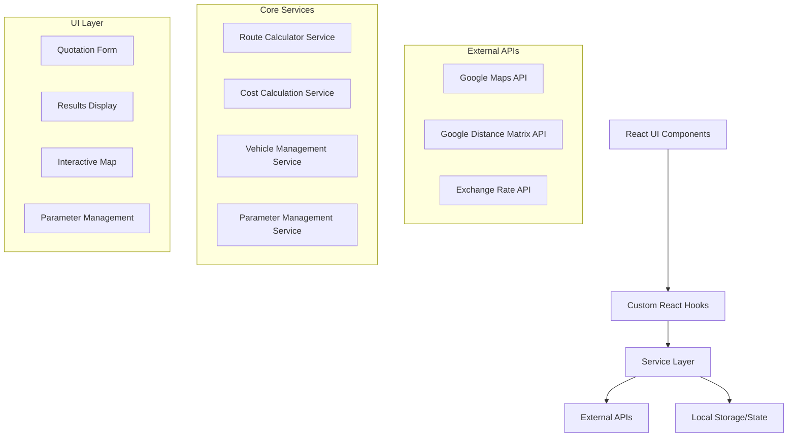

# Design Document

## Overview

The Enhanced Transportation Quotation System is a Next.js web application that provides comprehensive cost calculations, route planning, and pricing management for transportation services. The system integrates with Google Distance Matrix API and Google Maps API to calculate accurate routes, distances, and travel times while providing detailed cost breakdowns and pricing options with configurable profit margins.

The application follows a modular architecture with clear separation of concerns, utilizing React components for the UI, custom hooks for state management, and service layers for business logic and external API integrations.

## Architecture

### High-Level Architecture



### Technology Stack

- **Frontend Framework**: Next.js 14 with App Router
- **UI Library**: React 18 with TypeScript
- **Styling**: Tailwind CSS
- **State Management**: React Context + useReducer
- **Maps Integration**: Google Maps JavaScript API
- **HTTP Client**: Fetch API with custom service wrappers
- **Data Persistence**: localStorage for parameters and vehicle data
- **Form Handling**: React Hook Form with Zod validation

## Components and Interfaces

### Core Components

#### 1. QuotationForm Component
```typescript
interface QuotationFormProps {
  onSubmit: (data: QuotationRequest) => void;
  loading: boolean;
}

interface QuotationRequest {
  origin: string;
  destination: string;
  baseLocation: string;
  groupSize: number;
  extraMileage?: number;
}
```

#### 2. RouteMap Component
```typescript
interface RouteMapProps {
  origin: google.maps.LatLng;
  destination: google.maps.LatLng;
  baseLocation: google.maps.LatLng;
  route?: google.maps.DirectionsResult;
}
```

#### 3. CostBreakdown Component
```typescript
interface CostBreakdownProps {
  costs: DetailedCosts;
  vehicle: Vehicle;
  currency: 'USD' | 'HNL';
}
```

#### 4. PricingTable Component
```typescript
interface PricingTableProps {
  baseCost: number;
  markupOptions: number[];
  recommendedMarkup: number;
  exchangeRate: number;
}
```

#### 5. VehicleSelector Component
```typescript
interface VehicleSelectorProps {
  vehicles: Vehicle[];
  groupSize: number;
  onVehicleSelect: (vehicle: Vehicle) => void;
  selectedVehicle?: Vehicle;
}
```

### Service Interfaces

#### 1. Route Calculator Service
```typescript
interface RouteCalculatorService {
  calculateRoute(origin: string, destination: string, baseLocation: string): Promise<RouteResult>;
  getDistanceMatrix(origins: string[], destinations: string[]): Promise<DistanceMatrixResult>;
}

interface RouteResult {
  totalDistance: number;
  totalTime: number;
  route: google.maps.DirectionsResult;
  segments: RouteSegment[];
}
```

#### 2. Cost Calculation Service
```typescript
interface CostCalculationService {
  calculateTotalCosts(request: CostCalculationRequest): Promise<DetailedCosts>;
  calculateFuelCosts(distance: number, vehicle: Vehicle): FuelCosts;
  calculateDriverExpenses(duration: number): DriverExpenses;
  calculateVehicleCosts(distance: number, duration: number, vehicle: Vehicle): VehicleCosts;
}
```

#### 3. Vehicle Management Service
```typescript
interface VehicleManagementService {
  getVehicles(): Vehicle[];
  getVehiclesByCapacity(minCapacity: number): Vehicle[];
  addVehicle(vehicle: Vehicle): void;
  updateVehicle(id: string, vehicle: Partial<Vehicle>): void;
  deleteVehicle(id: string): void;
}
```

#### 4. Parameter Management Service
```typescript
interface ParameterManagementService {
  getParameters(): SystemParameters;
  updateParameter(key: string, value: number): void;
  getExchangeRate(): Promise<number>;
  setCustomExchangeRate(rate: number): void;
}
```

## Data Models

### Core Data Models

#### Vehicle Model
```typescript
interface Vehicle {
  id: string;
  make: string;
  model: string;
  year: number;
  passengerCapacity: number;
  fuelCapacity: number;
  fuelEfficiency: number;
  fuelEfficiencyUnit: 'mpg' | 'mpl' | 'kpl' | 'kpg';
  costPerDistance: number;
  costPerDay: number;
  distanceUnit: 'km' | 'mile';
}
```

#### System Parameters Model
```typescript
interface SystemParameters {
  fuelPrice: number;
  mealCostPerDay: number;
  hotelCostPerNight: number;
  exchangeRate: number;
  useCustomExchangeRate: boolean;
  preferredDistanceUnit: 'km' | 'mile';
  preferredCurrency: 'USD' | 'HNL';
}
```

#### Cost Models
```typescript
interface DetailedCosts {
  fuel: FuelCosts;
  driver: DriverExpenses;
  vehicle: VehicleCosts;
  refueling: RefuelingCosts;
  total: number;
}

interface FuelCosts {
  consumption: number;
  cost: number;
  pricePerUnit: number;
}

interface DriverExpenses {
  meals: number;
  lodging: number;
  days: number;
  total: number;
}

interface VehicleCosts {
  distanceCost: number;
  dailyCost: number;
  total: number;
}

interface RefuelingCosts {
  stops: number;
  costPerStop: number;
  total: number;
}
```

#### Pricing Models
```typescript
interface PricingOption {
  markup: number;
  cost: number;
  salePrice: number;
  salePriceUSD: number;
  salePriceHNL: number;
  recommended: boolean;
}

interface QuotationResult {
  route: RouteResult;
  costs: DetailedCosts;
  vehicle: Vehicle;
  pricing: PricingOption[];
  parameters: SystemParameters;
}
```

## Error Handling

### Error Types
```typescript
enum ErrorType {
  NETWORK_ERROR = 'NETWORK_ERROR',
  API_ERROR = 'API_ERROR',
  VALIDATION_ERROR = 'VALIDATION_ERROR',
  CALCULATION_ERROR = 'CALCULATION_ERROR',
  LOCATION_NOT_FOUND = 'LOCATION_NOT_FOUND'
}

interface AppError {
  type: ErrorType;
  message: string;
  details?: any;
}
```

### Error Handling Strategy
- **Network Errors**: Retry mechanism with exponential backoff
- **API Errors**: Graceful degradation with fallback calculations
- **Validation Errors**: Real-time form validation with clear error messages
- **Calculation Errors**: Default values and user notifications
- **Location Errors**: Suggestions for alternative locations

## Testing Strategy

### Unit Testing
- **Components**: Test rendering, props handling, and user interactions
- **Services**: Test business logic, API integrations, and error scenarios
- **Utilities**: Test calculation functions and data transformations
- **Hooks**: Test state management and side effects

### Integration Testing
- **API Integration**: Test Google Maps and Distance Matrix API calls
- **End-to-End Workflows**: Test complete quotation generation process
- **Cross-Component Communication**: Test data flow between components

### Testing Tools
- **Jest**: Unit and integration testing framework
- **React Testing Library**: Component testing utilities
- **MSW (Mock Service Worker)**: API mocking for tests
- **Playwright**: End-to-end testing (optional)

## Performance Considerations

### Optimization Strategies
- **API Caching**: Cache Google API responses for repeated requests
- **Debounced Input**: Debounce location input to reduce API calls
- **Lazy Loading**: Load map components only when needed
- **Memoization**: Memoize expensive calculations
- **Code Splitting**: Split code by routes and features

### Monitoring
- **Performance Metrics**: Track API response times and calculation performance
- **Error Tracking**: Monitor and log application errors
- **User Analytics**: Track user interactions and conversion rates

## Security Considerations

### API Security
- **API Key Protection**: Secure Google API keys with domain restrictions
- **Rate Limiting**: Implement client-side rate limiting for API calls
- **Input Validation**: Validate all user inputs before processing
- **XSS Prevention**: Sanitize user inputs and use secure rendering

### Data Protection
- **Local Storage**: Encrypt sensitive data stored locally
- **Parameter Security**: Validate parameter updates and maintain audit logs
- **Session Management**: Implement secure session handling for admin features

## Deployment and Infrastructure

### Development Environment
- **Local Development**: Next.js development server with hot reloading
- **Environment Variables**: Secure management of API keys and configuration
- **Development Tools**: ESLint, Prettier, TypeScript for code quality

### Production Deployment
- **Static Generation**: Pre-generate static pages where possible
- **CDN Integration**: Serve static assets through CDN
- **Environment Configuration**: Separate configurations for different environments
- **Monitoring**: Application performance and error monitoring

This design provides a solid foundation for implementing the enhanced transportation quotation system while maintaining scalability, maintainability, and user experience.